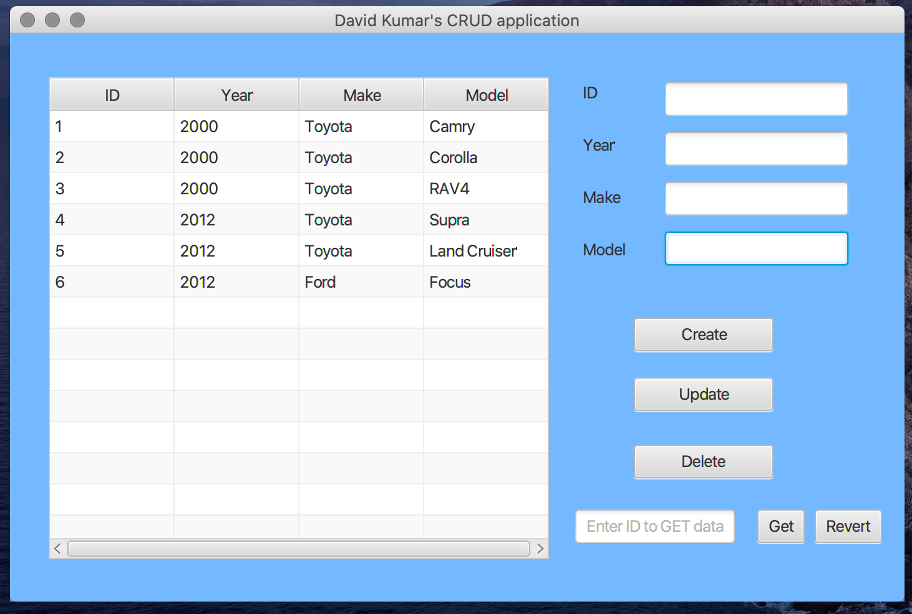

## CRUD-application-using-JavaFX-and-SQL

Desktop GUI application to Create, Retrieve, Update and Delete objects based solely on user input using the JavaFX library and MySQL.

The JDBC (Java Database Connectivity) API primarily has a back-end database system i.e. MySQL. The Java code fetches the records from the table in the database. The SQL (Structured Query Language) queries are fired from Java code and sent to the database engine for processing. The JDBC driver acts as an intermediary between the Java program and the database and interprets the volley of information on either side.

The JavaFX library leverages GUI components that can be used to represent database records in a more meaningful manner i.e. records displayed in a tabular form with the TableView control.

Demo: https://youtu.be/BcSxmjxH65M 
